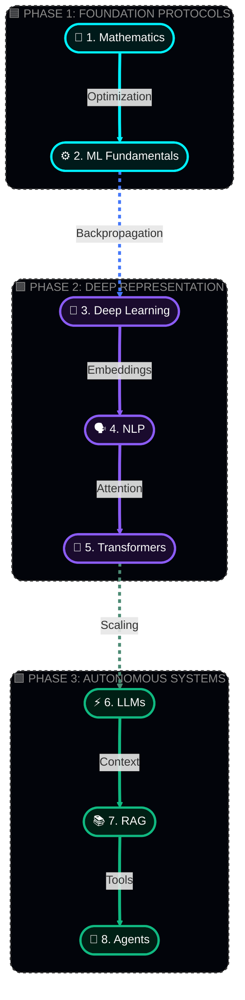
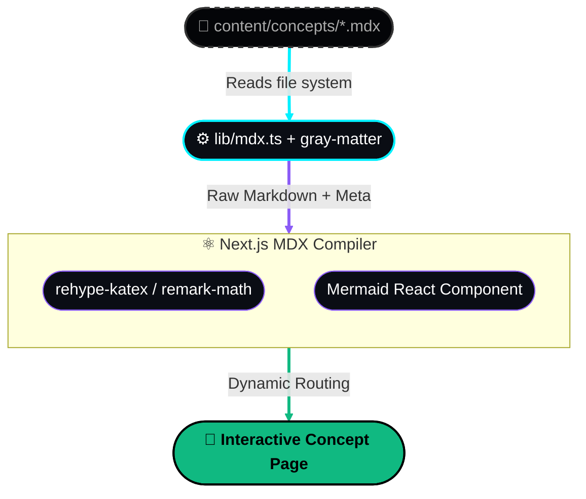

<div align="center">

  

  <br />
  <br />

  <h1 align="center" style="font-family: 'Fira Code', monospace; font-size: 3em; font-weight: 900; letter-spacing: 4px;">
    <kbd>&nbsp;N E U R A L P A T H&nbsp;</kbd>
  </h1>
  
  <p align="center">
    <code>[ MAP THE MACHINE // BUILD THE INTUITION ]</code>
  </p>

  <p align="center">
    <strong>A progressive, visual-first curriculum for the systems behind modern intelligence.</strong>
  </p>

  <br />

  [](https://nextjs.org)
  [](https://www.typescriptlang.org)
  [](https://mdxjs.com)
  []()
  [](https://github.com/PIYUSH1525/ZeroToAI)

</div>

---

## 🌌 What Is MLRoadmap?

MLRoadmap is an open learning hub for understanding **artificial intelligence, machine learning, deep learning, NLP, transformers, LLMs, retrieval, RAG, and agents** in the order that makes the ideas click.

The project is being built around a strict, iterative optimization loop:

<div align="center">
  
</div>

The goal is not to collect definitions. Each concept should explain **what it is**, **why it exists**, **how the mechanism works**, and **how to implement or reason about it**.

---

## 🗺️ The Learning Architecture

Our curriculum avoids the "black box" approach. We map the entire AI landscape across interconnected, high-resolution nodes. No concept is introduced before its mathematical and conceptual foundation is fully laid out.



### Curriculum Signal

| Layer | The Core Question | Architectural Focus |
| :--- | :--- | :--- |
| **Mathematics** | What are the underlying operations? | Vectors, matrices, probability, calculus |
| **ML Fundamentals** | How do models learn from data? | Regression, classification, loss, optimization |
| **Deep Learning** | How do layered representations emerge? | Neural networks, backpropagation, regularization |
| **NLP** | How can machines represent language? | Tokenization, embeddings, sequence modeling |
| **Transformers** | How can a model route information? | Attention, positional mapping, encoder-decoders |
| **LLMs** | How do models generate thought? | Pretraining, fine-tuning, inference, evaluation |
| **RAG** | How can models use external memory? | Retrieval, chunking, embeddings, generation |
| **Agents** | How can models plan and use tools? | Loops, memory, tool use, orchestration, safety |

---

## ⚙️ Content Pipeline Architecture

The platform runs on a lightweight, highly-optimized Next.js and MDX pipeline. Markdown files are dynamically parsed, injected with interactive React components, and served at edge speeds.



---

## 🚀 Initialize Local Environment

Want to run the platform locally or test a new module?

```bash
# 1. Clone the core repository
git clone [https://github.com/YOUR-USERNAME/ai-learning-hub.git](https://github.com/YOUR-USERNAME/ai-learning-hub.git)

# 2. Enter the directory
cd ai-learning-hub

# 3. Install node dependencies
npm install

# 4. Boot up the cyber engine
npm run dev
```

> **Access the portal:** Open `http://localhost:3000`

---

## 🤝 Contribution Protocols

New learning changes should make the path clearer, more accurate, or more useful. We welcome module additions from our conceptual roadmap.

### Pull Request Workflow

1. **Branch out:** `git checkout -b feature/add-backpropagation`
2. **Draft the module:** Create your `.mdx` file inside `content/concepts/`.
3. **Format strictly:** Every new file must start with this frontmatter:
   ```yaml
   ---
   title: "Name of Concept"
   order: 4
   category: "Deep Learning"
   difficulty: "Intermediate"
   description: "A short, 1-2 sentence description of the concept."
   ---
   ```
4. **Enrich:** Use KaTeX (`$$`) for equations and Mermaid (`<Mermaid chart="..." />`) for diagrams.
5. **Validate & Push:**
   ```bash
   npm run lint
   npm run build
   git add .
   git commit -m "feat: add backpropagation module"
   git push -u origin feature/add-backpropagation
   ```
6. Open a **Pull Request** on GitHub!

---

## 🐛 Anomaly Reporting (Issues)

Found a hallucination, a mathematical inaccuracy, or a broken Mermaid diagram? 

Open a new issue from the repository's **Issues** tab with:
* A specific title (e.g., *Fix gradient descent derivative error*).
* The `.mdx` file where the problem appears.
* What you expected vs. what you found.
* The correct behavior, equation, or reproduction steps.

---
<div align="center">
  
  <p><i>Built for future AI engineers. Learn the mechanism. Question the output. Build with intent.</i></p>
</div>
